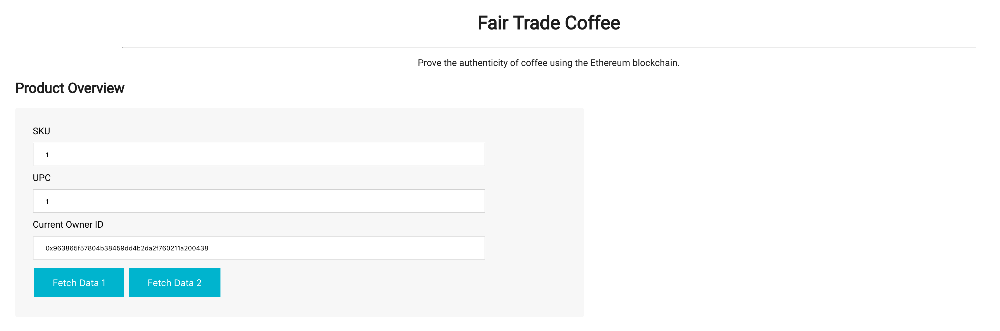
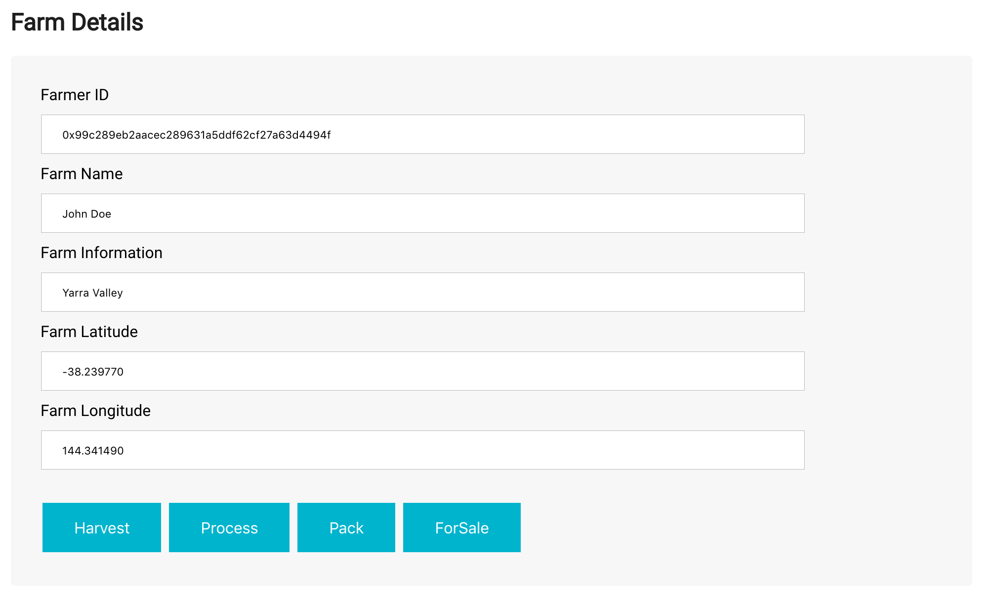
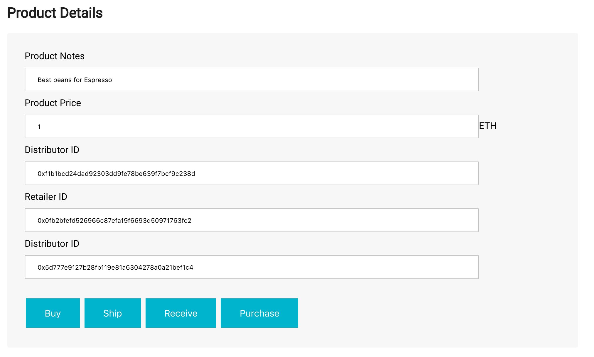
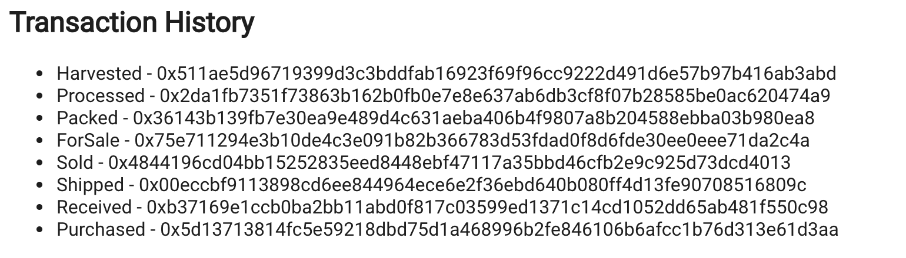
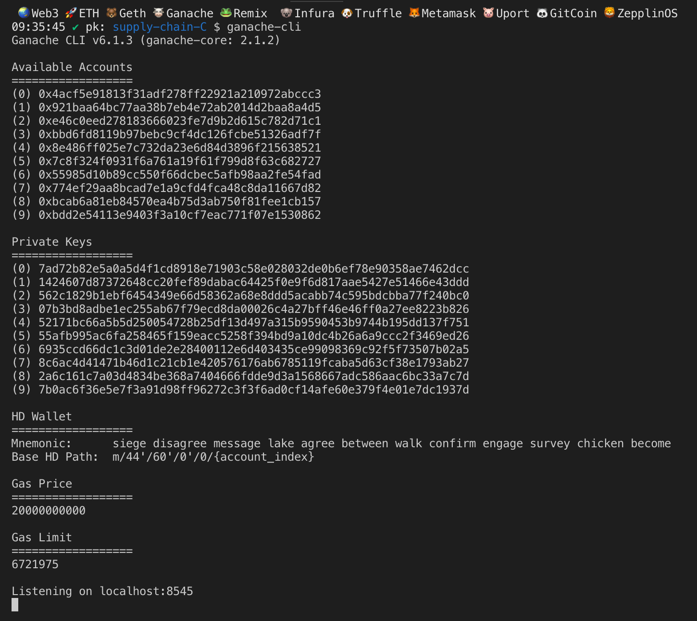
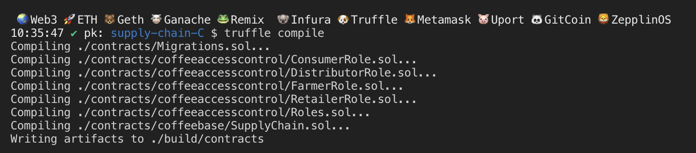
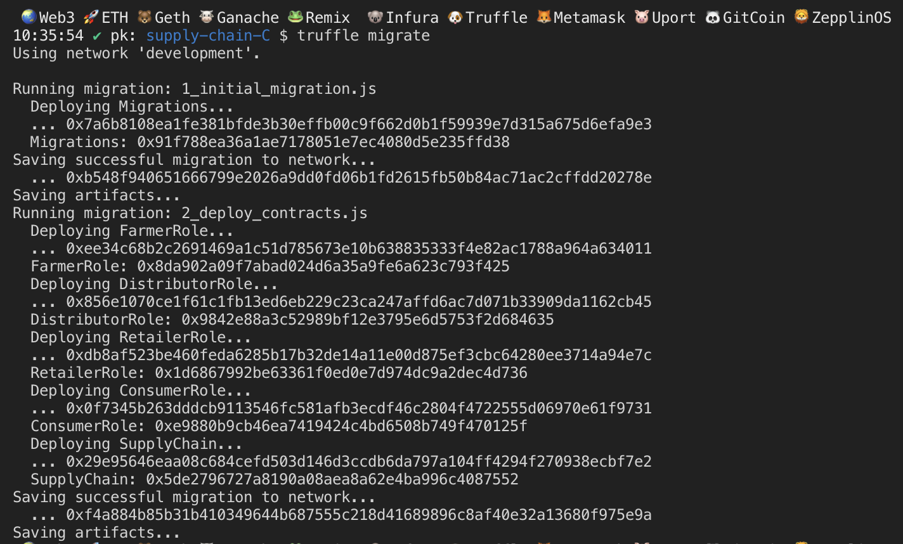
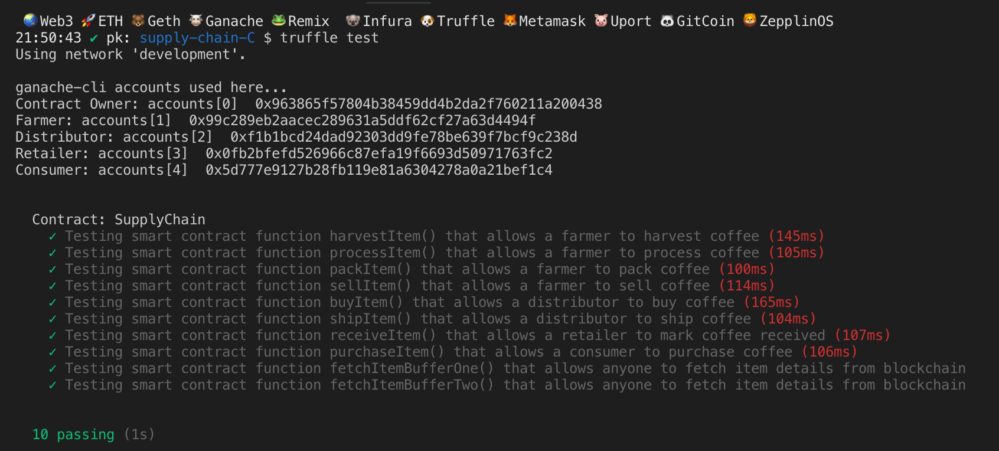

# Supply chain & data auditing

This repository containts an Ethereum DApp that demonstrates a Supply Chain flow between a Seller and Buyer. The user story is similar to any commonly used supply chain process. A Seller can add items to the inventory system stored in the blockchain. A Buyer can purchase such items from the inventory system. Additionally a Seller can mark an item as Shipped, and similarly a Buyer can mark an item as Received.

The DApp User Interface when running should look like...










## Getting Started

These instructions will get you a copy of the project up and running on your local machine for development and testing purposes. See deployment for notes on how to deploy the project on a live system.

### Prerequisites

Please make sure you've already installed ganache-cli, Truffle and enabled MetaMask extension in your browser.

```
Give examples (to be clarified)
```

### Installing

A step by step series of examples that tell you have to get a development env running

Clone this repository:

```
git clone https://github.com/udacity/nd1309/tree/master/course-5/project-6
```

Change directory to ```project-6``` folder and install all requisite npm packages (as listed in ```package.json```):

```
cd project-6
npm install
```

Launch Ganache:

```
ganache-cli
```

Your terminal should look something like this:



In a separate terminal window, Compile smart contracts:

```
truffle compile
```

Your terminal should look something like this:



This will create the smart contract artifacts in folder ```build\contracts```.

Migrate smart contracts to the locally running blockchain, ganache-cli:

```
truffle migrate
```

Your terminal should look something like this:



Test smart contracts:

```
truffle test
```

All 10 tests should pass.



## Migrate Status
Using network 'rinkeby'.

Running migration: 1_initial_migration.js
  Deploying Migrations...
  ... 0x34db79276c2b1a9252085693e0b6c843a620c9543f43bba85bc8ca0b916f43bc
  Migrations: 0x39072e1ecdbe075fad32e6ab3030d36d4f45eadd
Saving successful migration to network...
  ... 0xfdb7314cc429d9e47d2ec1c4c109bb6b937035d3277cd37eb14399dd3f2d8500
Saving artifacts...
Running migration: 2_deploy_contracts.js
  Deploying ManufacturerRole...
  ... 0xd93a8c09011ff3773dc6619623b1fba6393c14b280e5b0bcad9acf2b75d2849d
  ManufacturerRole: 0x415e955f7a8856941c8f271f9e06934c66d93606
  Deploying RetailerRole...
  ... 0x76563e8f6dff8966b34c5c2e088adf366e1c75fb4a098b77c36d4d59b5403e63
  RetailerRole: 0x8b2327fcd8795e9189707d35fa6c68dbdba20306
  Deploying CustomerRole...
  ... 0x366b68d9a8f9553eab6d780670b3276ff27f307c30b25faa9b30d1805d9675c8
  CustomerRole: 0xf0e07d52a3267a5d1d353eecf75f293a3beb31b8
  Deploying SupplyChain...
  ... 0x9555a5e57d5efe9d6bade4ec4624317d90c88492e45bd900eccadaf47a81a378
  SupplyChain: 0xd059e925df806f327550f09086e6f9798f6f7b15
Saving successful migration to network...
  ... 0xe4db1c604b40bdecd3ffbaf2ad1001a6208f1dfb6880e152074d4ec902f053be
Saving artifacts...


## Wallet Address
- https://rinkeby.etherscan.io/address/0x5d18bcd1231c1e53aa3a18c793fefab0b308d5a5

## Contract Address
- https://rinkeby.etherscan.io/tx/0x34db79276c2b1a9252085693e0b6c843a620c9543f43bba85bc8ca0b916f43bc

## Built With

* [Ethereum](https://www.ethereum.org/) - Ethereum is a decentralized platform that runs smart contracts
* [IPFS](https://ipfs.io/) - IPFS is the Distributed Web | A peer-to-peer hypermedia protocol
to make the web faster, safer, and more open.
* [Truffle Framework](http://truffleframework.com/) - Truffle is the most popular development framework for Ethereum with a mission to make your life a whole lot easier.


## Authors

See also the list of [contributors](https://github.com/your/project/contributors.md) who participated in this project.

## Acknowledgments

* Solidity
* Ganache-cli
* Truffle
* IPFS
