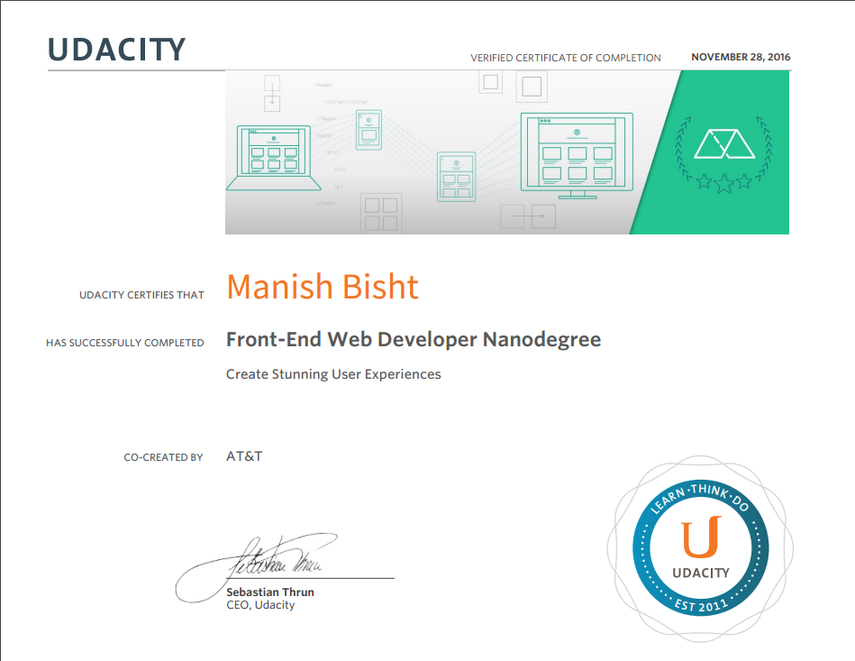
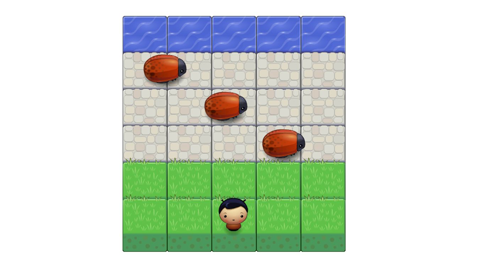
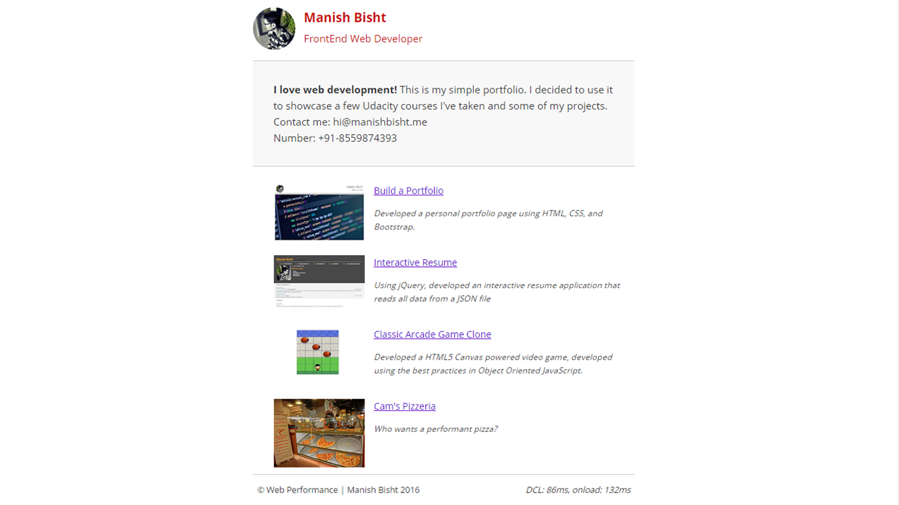
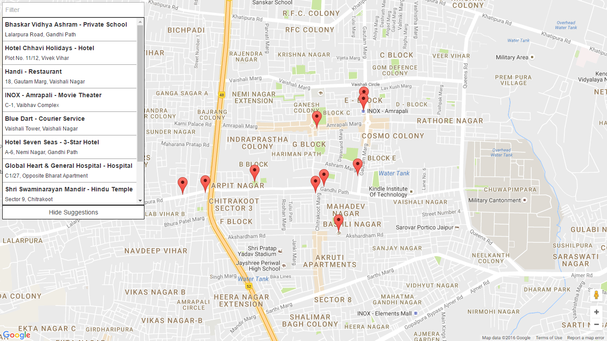
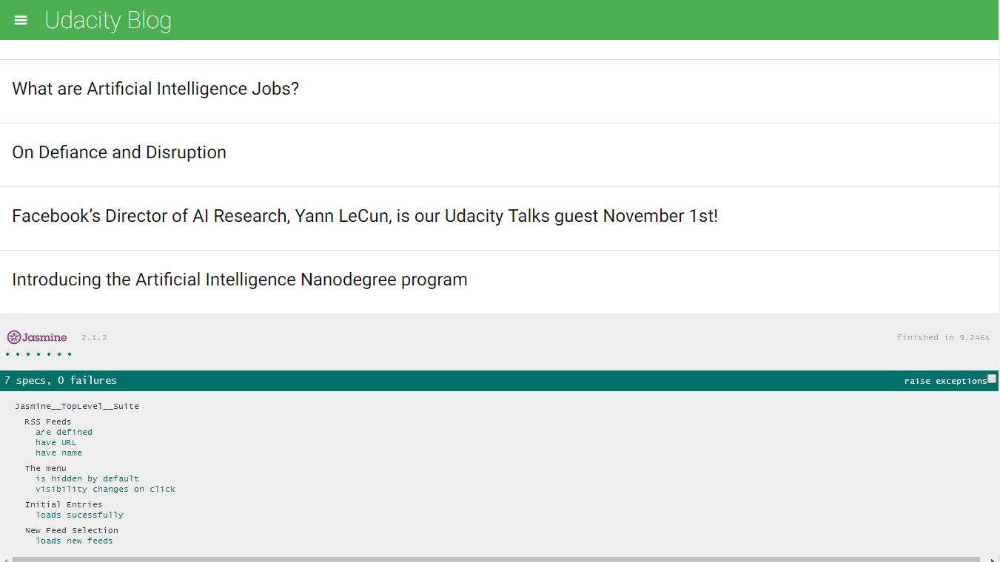

# Front-End Web Development Nanodegree (October 2016 - November 2016)

## 1. Project: Build a Portfolio Site
Developed a personal portfolio page using HTML, CSS, and the Bootstrap framework. The page is fully responsive and works on mobile, tablet, and desktop browsers.

[Project Demo](https://manishbisht.github.io/Udacity/FrontEnd%20Web%20Developer%20Nanodegree/P1%20-%20Build%20a%20Portfolio%20Site/) | [Project Code](https://github.com/manishbisht/Udacity/tree/master/FrontEnd%20Web%20Developer%20Nanodegree/P1%20-%20Build%20a%20Portfolio%20Site) | [Download Project](https://udacity-github-sync-content.s3.amazonaws.com/_submissions/247110_pufph.zip) | [Project Review](https://review.udacity.com/#!/reviews/247110/shared)

 
## 2. Project: Interactive Resume
Using jQuery, developed an interactive resume application that reads all data from a JSON file and then dynamically modifies the DOM to display the information. Further customized the project by personalizing the design using CSS.

[Project Demo](https://manishbisht.github.io/Udacity/FrontEnd%20Web%20Developer%20Nanodegree/P2%20-%20Online%20Resume) | [Project Code](https://github.com/manishbisht/Udacity/tree/master/FrontEnd%20Web%20Developer%20Nanodegree/P2%20-%20Online%20Resume) | [Download Project](https://udacity-github-sync-content.s3.amazonaws.com/_submissions/247934_hok9e.zip) | [Project Review](https://review.udacity.com/#!/reviews/247934/shared)

## 3. Project: Classic Arcade Game Clone
Developed a HTML5 Canvas powered video game, developed using the best practices in Object Oriented JavaScript.

[Project Demo](https://manishbisht.github.io/Udacity/FrontEnd%20Web%20Developer%20Nanodegree/P3%20-Classic%20Arcade%20Game/) | [Project Code](https://github.com/manishbisht/Udacity/tree/master/FrontEnd%20Web%20Developer%20Nanodegree/P3%20-Classic%20Arcade%20Game) | [Download Project](https://udacity-github-sync-content.s3.amazonaws.com/_submissions/263069_vcily.zip) | [Project Review](https://review.udacity.com/#!/reviews/263069/shared)

## 4. Project: Website Optimization
Optimized an inefficient web application's JavaScript, CSS and assets delivery, ensuring it runs at 60fps and achieves a PageSpeed score of at least 90.

[Project Demo](https://manishbisht.github.io/Udacity/FrontEnd%20Web%20Developer%20Nanodegree/P4%20-Website%20Optimization/) | [Project Code](https://github.com/manishbisht/Udacity/tree/master/FrontEnd%20Web%20Developer%20Nanodegree/P4%20-Website%20Optimization) | [Download Project](https://udacity-github-sync-content.s3.amazonaws.com/_submissions/268234_xqda4.zip) | [Project Review](https://review.udacity.com/#!/reviews/268234/shared)

## 5. Project: Neighborhood Map
A single-page web application, built using the Knockout framework, that displays a Google Map of an area and various points of interest. Users can search all included landmarks and, when selected, additional information about a landmark is presented from the FourSquare and Wikipedia APIs.

[Project Demo](http://manishbisht.github.io/Udacity/FrontEnd%20Web%20Developer%20Nanodegree/P5%20-%20Neighborhood%20Map) | [Project Code](https://github.com/manishbisht/Udacity/tree/master/FrontEnd%20Web%20Developer%20Nanodegree/P5%20-%20Neighborhood%20Map) | [Download Project](https://udacity-github-sync-content.s3.amazonaws.com/_submissions/274614_ohrmr.zip) | [Project Review](https://review.udacity.com/#!/reviews/274614/shared) 

## 6. Project: Feed Reader Testing
Wrote comprehensive unit tests, using the Jasmine testing framework, for an RSS Feed Reader application that uses Google's RSS API.

[Project Demo](https://manishbisht.github.io/Udacity/FrontEnd%20Web%20Developer%20Nanodegree/P6%20-%20Feed%20Reader%20Testing) | [Project Code](https://github.com/manishbisht/Udacity/tree/master/FrontEnd%20Web%20Developer%20Nanodegree/P6%20-%20Feed%20Reader%20Testing) | [Download Project](https://udacity-github-sync-content.s3.amazonaws.com/_submissions/276462_4iut0.zip) | [Project Review](https://review.udacity.com/#!/reviews/276462/shared) 

