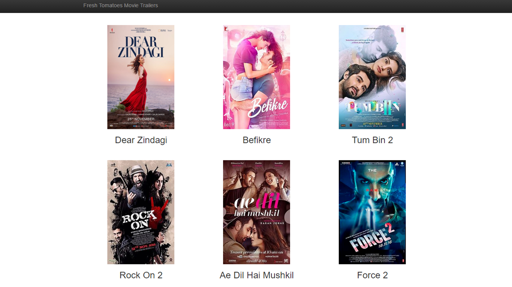
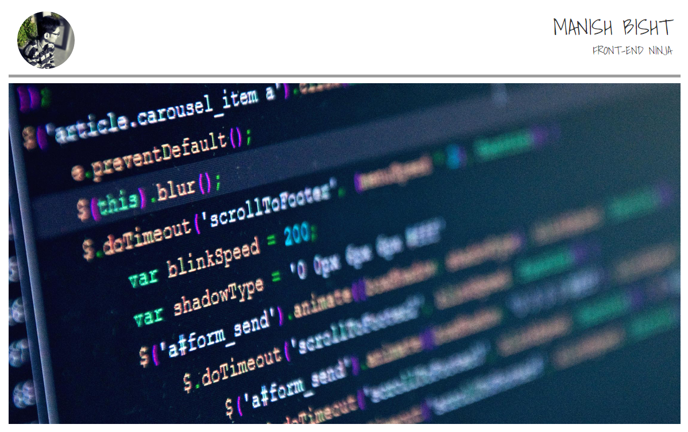

# Full Stack Web Developer Nanodegree (November 2016 - Present)

## 1. Project: Movie Trailer Website
Server-side code written in Python to store a list of my favorite movies, including box art imagery and a movie trailer URL. This data is then served to a web page using HTML and CSS allowing visitors to review these movies and watch the trailers.

[Project Demo](https://manishbisht.github.io/Udacity/Full%20Stack%20Web%20Developer%20Nanodegree/P1%20-%20Movie%20Trailer%20Website/fresh_tomatoes.html) | [Project Code](https://github.com/manishbisht/Udacity/tree/master/Full%20Stack%20Web%20Developer%20Nanodegree/P1%20-%20Movie%20Trailer%20Website) | [Download Project](https://udacity-github-sync-content.s3.amazonaws.com/_submissions/281758_964h6.zip) | [Project Review](https://review.udacity.com/#!/reviews/281758/shared)

 
## 2. Project: Build a Portfolio
Developed a personal portfolio page using HTML, CSS, and the Bootstrap framework. The page is fully responsive and works on mobile, tablet, and desktop browsers.

[Project Demo](https://manishbisht.github.io/Udacity/FrontEnd%20Web%20Developer%20Nanodegree/P1%20-%20Build%20a%20Portfolio%20Site/) | [Project Code](https://github.com/manishbisht/Udacity/tree/master/FrontEnd%20Web%20Developer%20Nanodegree/P1%20-%20Build%20a%20Portfolio%20Site) | [Download Project](https://udacity-github-sync-content.s3.amazonaws.com/_submissions/247110_pufph.zip) | [Project Review](https://review.udacity.com/#!/reviews/247110/shared)

## 3. Project: Multi User Blog

## 4. Project: Tournament Results

## 5. Project: Item Catalog

## 6. Project: Neighborhood Map
A single-page web application, built using the Knockout framework, that displays a Google Map of an area and various points of interest. Users can search all included landmarks and, when selected, additional information about a landmark is presented from the FourSquare and Wikipedia APIs.

[Project Demo](http://manishbisht.github.io/Udacity/FrontEnd%20Web%20Developer%20Nanodegree/P5%20-%20Neighborhood%20Map) | [Project Code](https://github.com/manishbisht/Udacity/tree/master/FrontEnd%20Web%20Developer%20Nanodegree/P5%20-%20Neighborhood%20Map) | [Download Project](https://udacity-github-sync-content.s3.amazonaws.com/_submissions/274614_ohrmr.zip) | [Project Review](https://review.udacity.com/#!/reviews/274614/shared) 

## 7. Project: Linux Server Configuration